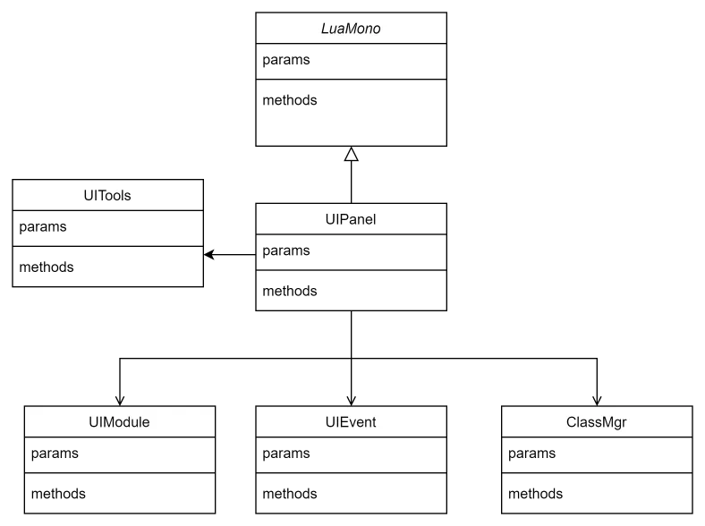

# **JoyCastle**前端岗位笔试题


## 1.

移动

```c#
void Move(GameObject gameObject, Vector3 begin, Vector3 end, float time, bool pingpong)
    {
        gameObject.transform.position = begin;
        
        if (pingpong)
        {
            float pingPong = Mathf.PingPong(Time.time, time);
            float p = Mathf.InverseLerp(0, time, pingPong);
            gameObject.transform.position = Vector3.Lerp(begin, end, p);
        }
        else
        {
            float t = Time.time*(distance/time)/distance
            gameObject.transform.position = Vector3.Lerp(begin, end, t);
            
           
        }
    }
   
```

渐变

```c#
IEnumerator FadeIn(GameObject gameObject, float time)
    {
        float startTime = Time.time;
        
        var startColor = obj.GetComponent<MeshRenderer>().material.color
        var alphaColor = startColor; 
        alphaColor.a = 0;
        
        while (Time.time < startTime + time)
        {
            float t = (Time.time - startTime) / duration;
            obj.GetComponent<MeshRenderer>().material.color = Color.Lerp(alphaColor, startColor, t);
            yield return null;
        }
    }
    
    Ienumerator FadeOut(GameObject gameObject, float time)
    {
        float startTime = Time.time;
        var startColor = obj.GetComponent<MeshRenderer>().material.color
        var alphaColor = startColor; 
        alphaColor.a = 0;
        
        while (Time.time < startTime + time)
        {
            float t = (Time.time - startTime) / duration;
            obj.GetComponent<MeshRenderer>().material.color = Color.Lerp(startColor, alphaColor, t);
            yield return null;
        }    
    }
    
    Ienumerator FadeInOut(GameObject gameObject, float time)
    {
        float startTime = Time.time;
        
        var startColor = obj.GetComponent<MeshRenderer>().material.color
        var alphaColor = startColor; 
        alphaColor.a = 0;
        
        while (Time.time < startTime + time / 2)
        {
            float t = (Time.time - startTime) / duration;
            obj.GetComponent<MeshRenderer>().material.color = Color.Lerp(alphaColor, startColor, t);
            yield return null;
        }
        yield return new WaitForSeconds(2);
        
        StartCoroutine(FadeOut(gameObject, time / 2));
    }

// 使用
StartCoroutine(FadeIn(gameObject, time));
 
```


## 2.

请从上到下依次打印出一颗二叉树的最左侧节点。

```c#
public List<int> LevelOrder(TreeNode root) {
        List<int> ans = new List<int>();
        if (root == null) {
            return ans;
        }
        Queue<TreeNode> queue = new Queue<TreeNode>();
        
        queue.Enqueue(root);
        while (queue.Count > 0) {
           
            bool isAdd = true;
            int size = queue.Count;
            for (int i = 0; i < size; i++) {
                TreeNode node = queue.Dequeue();
                if(isAdd){
                    ans.Add(node.val);
                    isAdd = false;
                }
                
                if (node.left != null) {
                    queue.Enqueue(node.left);
                }
                if (node.right != null) {
                    queue.Enqueue(node.right);
                }
            }
        }
        return ans;
    }

```

## 3.

UITools 负责快捷创建UI界面

LuaMono Lua端生命周期的实现

UIPanel 界面具体逻辑

UIModule UI相关逻辑处理

UIEvent 各类点击事件的处理

ClassMgr 类的管理

